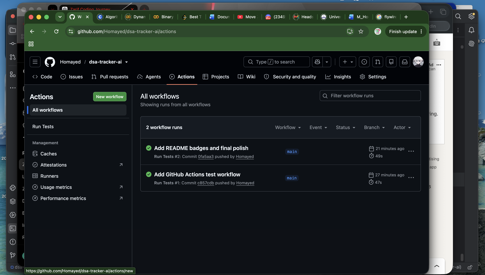
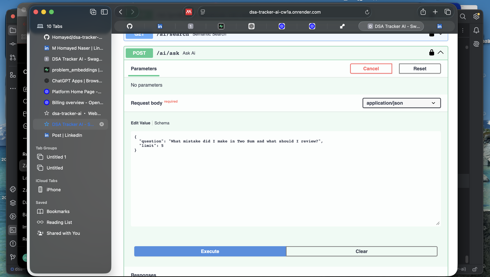
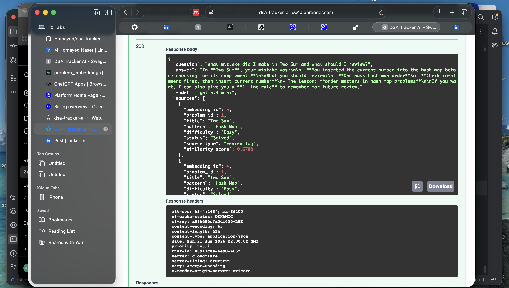

# DSA Tracker AI API

[](https://github.com/Homayed/dsa-tracker-ai/actions/workflows/tests.yml)


A production-style **AI-assisted DSA learning tracker backend** built with **FastAPI, PostgreSQL, Supabase, pgvector, OpenAI embeddings, and RAG**.

This project helps users track solved DSA problems, notes, mistakes, review logs, confidence levels, and then uses AI to provide semantic search, personalized answers, and study recommendations based on the user’s own learning data.

## Live Demo

**Live API:**
https://dsa-tracker-ai-cw1a.onrender.com

**Swagger Docs:**
https://dsa-tracker-ai-cw1a.onrender.com/docs

> Note: The API is hosted on Render free tier, so the first request may take a little time if the service is asleep.

---

## Demo Screenshots

### GitHub Actions CI Success

The project includes a GitHub Actions workflow that automatically runs the test suite on every push to the `main` branch. This confirms that the backend is tested and the CI pipeline is working successfully.



---

### Live RAG AI Request

The `/ai/ask` endpoint accepts a user question and uses the saved DSA learning data as context. The question is converted into an embedding, matched against stored vectors in Supabase PostgreSQL with pgvector, and then sent to an LLM with the retrieved context.



---

### Live RAG AI Response

The response shows the AI answering based on the user's own saved learning data, such as problems, notes, mistakes, and review logs. This demonstrates the working RAG flow: retrieval from vector search + LLM-generated personalized feedback.




## Project Purpose

The goal of this project is to build more than a normal CRUD backend.

This API works as an **AI-powered learning analytics system** for DSA preparation. It can track:

* Solved DSA problems
* Problem patterns
* Difficulty levels
* Confidence level
* Time taken
* Solution code
* Notes
* Mistakes
* Lessons learned
* Review logs
* Progress over time

Then it uses AI to answer questions like:

* “What mistake did I make in Two Sum?”
* “What should I review about hash map problems?”
* “Give me a 7-day study plan based on my progress.”
* “Which problems am I weak in?”

This makes the project useful as both a **backend portfolio project** and a foundation for an **AI-assisted learning research prototype**.

---

## Tech Stack

### Backend

* FastAPI
* Python
* SQLAlchemy ORM
* Pydantic
* Alembic migrations
* JWT authentication
* Pytest

### Database

* Supabase PostgreSQL
* pgvector
* PostgreSQL session pooler

### AI

* OpenAI API
* `text-embedding-3-small` for embeddings
* GPT mini model for AI answers and study recommendations
* RAG-based question answering
* Semantic search with vector similarity

### DevOps / Deployment

* Docker
* Docker Compose
* Render deployment
* GitHub
* Environment variable based configuration

---

## Main Features

## 1. Authentication

Users can register and log in using JWT-based authentication.

Implemented endpoints include:

* `POST /auth/register`
* `POST /auth/login`
* `GET /users/me`

All user data is protected so each user can only access their own problems, notes, mistakes, reviews, and AI results.

---

## 2. DSA Problem Tracking

Users can create, read, update, delete, filter, and search their DSA problems.

Tracked problem fields include:

* Title
* Platform
* Difficulty
* Pattern
* Status
* Confidence level
* Time taken
* Solution code
* Time complexity
* Space complexity
* Solved date

Example problem:

```json
{
  "title": "Two Sum",
  "platform": "LeetCode",
  "difficulty": "Easy",
  "pattern": "Hash Map",
  "status": "Solved",
  "confidence_level": 4,
  "time_taken_minutes": 20,
  "solution_code": "class Solution: ...",
  "time_complexity": "O(n)",
  "space_complexity": "O(n)",
  "solved_at": "2026-06-21T21:18:08.235Z"
}
```

---

## 3. Notes Tracking

Users can add notes for each problem.

Example use case:

```text
I learned that Two Sum uses a hash map to store previous values and check the complement before inserting the current number.
```

Notes are also embedded into the vector database so the AI can use them later for RAG answers.

---

## 4. Mistake Tracking

Users can record mistakes made while solving problems.

Tracked mistake fields:

* Mistake category
* Description
* Lesson learned

Example:

```json
{
  "mistake_category": "Logic Mistake",
  "description": "I inserted the current number before checking the complement.",
  "lesson_learned": "In one-pass hash map problems, check the complement first, then insert the current number."
}
```

Mistakes are embedded and used by the AI assistant to explain what the user should review.

---

## 5. Review Logs

Users can track review sessions for each problem.

Tracked review fields:

* Confidence before
* Confidence after
* Was solved again
* Time taken
* Review notes

Example:

```json
{
  "confidence_before": 3,
  "confidence_after": 5,
  "was_solved_again": true,
  "time_taken_minutes": 18,
  "notes": "Reviewed Two Sum again and understood the hash map complement order."
}
```

Review logs help the AI understand learning progress over time.

---

## 6. Dashboard and Progress Analytics

The API includes dashboard and progress endpoints that summarize user learning data.

Examples include:

* Total solved problems
* Easy / Medium / Hard counts
* Review-again problems
* Struggling problems
* Average confidence
* Weak patterns
* Problems needing review

Endpoints include:

* `GET /dashboard/summary`
* `GET /progress/weak-patterns`
* `GET /progress/review-needed`

---

## 7. pgvector Embedding System

The project uses Supabase PostgreSQL with pgvector to store embeddings.

The `problem_embeddings` table stores vector data for:

* Problems
* Notes
* Mistakes
* Review logs

Each embedding stores:

* User ID
* Problem ID
* Source type
* Source ID
* Content
* Embedding vector
* Embedding model

Source types:

```text
problem
note
mistake
review_log
```

This allows the AI system to search across the user’s complete learning history.

---

## 8. Semantic Search

The API supports semantic search using OpenAI embeddings and pgvector similarity search.

Endpoint:

```text
GET /ai/search?q=hash map lookup&limit=5
```

Example use case:

```text
Search: "hash map complement mistake"
```

The API converts the query into an embedding, compares it with saved embeddings, and returns the most relevant problems, notes, mistakes, or review logs.

---

## 9. RAG Answer Endpoint

The project includes a Retrieval-Augmented Generation endpoint.

Endpoint:

```text
POST /ai/ask
```

Example request:

```json
{
  "question": "What mistake did I make in Two Sum and what should I review?",
  "limit": 5
}
```

Example response summary:

```text
You inserted the current number before checking the complement.
Review one-pass hash map order:
1. Check complement first
2. Then insert current number
```

The AI answer is generated from the user’s saved tracker data, not from generic memory alone.

---

## 10. AI Study Recommendation Endpoint

The API can generate a personalized study plan from saved tracker data.

Endpoint:

```text
POST /ai/recommend-study-plan
```

Example request:

```json
{
  "days": 7
}
```

The AI uses:

* Solved problems
* Confidence levels
* Mistakes
* Notes
* Review logs
* Patterns
* Time complexity records

And returns a personalized study plan with:

* Weak patterns
* Problems to review first
* Mistakes to focus on
* Day-by-day study plan
* Realistic motivation

---

## 11. Auto-Embedding System

The project supports automatic embedding creation when learning content is created or updated.

Auto-embedding works for:

* Problems
* Notes
* Mistakes
* Review logs

It can be controlled using an environment variable:

```env
AI_AUTO_EMBED=true
```

For production/demo safety, this can be turned off:

```env
AI_AUTO_EMBED=false
```

This protects OpenAI API credit from being used automatically.

---

## 12. AI Usage and Cost Control

The project includes AI safety controls.

Environment variables:

```env
AI_ENABLED=true
AI_AUTO_EMBED=false
```

Meaning:

```text
AI_ENABLED=false
```

disables AI endpoints safely.

```text
AI_AUTO_EMBED=false
```

prevents automatic OpenAI embedding calls when creating or updating data.

The API also includes safe error handling for:

* Missing API key
* Authentication error
* Rate limit error
* Quota or billing issue
* OpenAI service error

Instead of crashing, the API returns clean HTTP error messages.

---

## API Endpoints Overview

### Auth

```text
POST /auth/register
POST /auth/login
GET /users/me
```

### Problems

```text
POST /problems/
GET /problems/
GET /problems/{problem_id}
PUT /problems/{problem_id}
DELETE /problems/{problem_id}
```

### Notes

```text
POST /problems/{problem_id}/notes
GET /problems/{problem_id}/notes
PUT /notes/{note_id}
DELETE /notes/{note_id}
```

### Mistakes

```text
POST /problems/{problem_id}/mistakes
GET /problems/{problem_id}/mistakes
PUT /mistakes/{mistake_id}
DELETE /mistakes/{mistake_id}
```

### Review Logs

```text
POST /problems/{problem_id}/reviews
GET /problems/{problem_id}/reviews
PUT /reviews/{review_id}
DELETE /reviews/{review_id}
```

### Dashboard and Progress

```text
GET /dashboard/summary
GET /progress/weak-patterns
GET /progress/review-needed
```

### AI

```text
POST /ai/problems/{problem_id}/embed
GET /ai/search
POST /ai/ask
POST /ai/recommend-study-plan
```

---

## Architecture

```text
User / Swagger / Frontend
        |
        v
Render Web Service
FastAPI Backend
        |
        v
Supabase PostgreSQL
+ pgvector
        |
        v
OpenAI API
Embeddings + AI Answers
```

---

## Local Setup

### 1. Clone the repository

```bash
git clone https://github.com/Homayed/dsa-tracker-ai.git
cd dsa-tracker-ai
```

### 2. Create virtual environment

```bash
python -m venv .venv
source .venv/bin/activate
```

### 3. Install dependencies

```bash
pip install -r requirements.txt
```

### 4. Create `.env`

Create a `.env` file based on `.env.example`.

Example:

```env
DATABASE_URL=your_database_url_here
SECRET_KEY=your_secret_key_here
ALGORITHM=HS256
ACCESS_TOKEN_EXPIRE_MINUTES=30

OPENAI_API_KEY=your_openai_api_key_here
OPENAI_CHAT_MODEL=gpt-5.4-mini

AI_ENABLED=true
AI_AUTO_EMBED=false
```

### 5. Run migrations

```bash
alembic upgrade head
```

### 6. Start the app

```bash
uvicorn main:app --reload
```

Open:

```text
http://127.0.0.1:8000/docs
```

---

## Docker Setup

The project includes Docker support.

Build and run:

```bash
docker compose up --build
```

The app starts with:

```text
./start.sh
```

The startup script runs:

```bash
alembic upgrade head
uvicorn main:app
```

---

## Testing

The project uses Pytest.

Run:

```bash
pytest
```

Current test status:

```text
46 passed
```

Tests cover:

* Auth
* Protected routes
* Problem CRUD
* Notes
* Mistakes
* Review logs
* Dashboard
* Progress analytics
* AI embedding endpoints
* Auto-embedding behavior
* Embedding cleanup on delete
* AI study recommendation endpoint

OpenAI calls are mocked in tests, so running `pytest` does not spend API credit.

---

## Deployment

The API is deployed on Render.

Live URL:

```text
https://dsa-tracker-ai-cw1a.onrender.com
```

Swagger:

```text
https://dsa-tracker-ai-cw1a.onrender.com/docs
```

Production/demo environment recommendation:

```env
AI_ENABLED=true
AI_AUTO_EMBED=false
```

This keeps AI endpoints available while preventing automatic OpenAI spending.

---

## Why This Project Is Strong

This project demonstrates:

* Production-style FastAPI backend structure
* JWT authentication
* User-owned protected resources
* PostgreSQL with SQLAlchemy
* Alembic migrations
* Supabase cloud database integration
* pgvector-based semantic search
* OpenAI embeddings
* RAG answer generation
* Personalized AI study planning
* AI usage and cost control
* Docker deployment
* Render deployment
* Automated tests with mocked AI calls

It is not just a CRUD app. It is an AI-powered backend that connects learning analytics with real user progress data.

---

## Future Improvements

Planned next improvements:

* Frontend dashboard
* LangChain integration
* LangGraph study agent
* Background jobs for controlled embedding generation
* Advanced weak-pattern analytics
* Weekly AI review plan generation
* Better source ranking and filtering
* User feedback on AI recommendations
* Admin/demo mode
* CI/CD pipeline with GitHub Actions

---

## Project Status

Current status:

```text
Backend: Complete
Supabase PostgreSQL: Connected
pgvector: Enabled
OpenAI embeddings: Working
RAG endpoint: Working
Study recommendation endpoint: Working
Render deployment: Live
Tests: 46 passed
```

This project is actively being developed as a portfolio-grade AI backend and learning analytics system.
